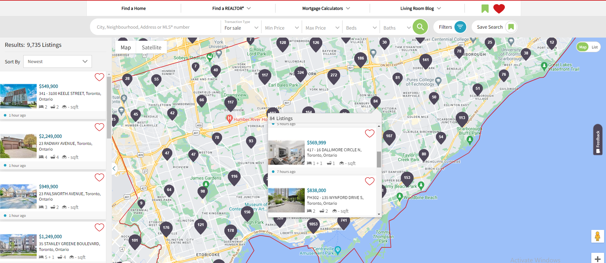

# Open Real Estate Platform

An open-source real estate management platform for the Canadian market, designed to simplify property listings, search, and management. The platform includes features such as advanced property search, detailed property listings, user management, and analytics.

## Table of Contents

- [Installation](#installation)
- [Usage](#usage)
- [Features](#features)
- [Contributing](#contributing)
- [License](#license)
- [Contact](#contact)

## Installation

### Prerequisites

- Node.js
- npm or yarn
- MongoDB

### Steps

1. Clone the repository:
    ```bash
    git clone https://github.com/phoenix0018/Open-Real-Estate-Platform.git
    ```
2. Navigate to the project directory:
    ```bash
    cd open-real-estate-platform
    ```
3. Install dependencies:
    ```bash
    npm install
    ```
4. Set up environment variables:
    Create a `.env` file in the root directory and add the following:
    ```env
    MONGO_URI=mongodb://localhost:27017/realestate
    PORT=3000
    ```
5. Start the development server:
    ```bash
    npm start
    ```

## Usage

1. Open your browser and go to `http://localhost:3000`.
2. Sign up or log in to your account.
3. Add a new property by clicking on the "Add Property" button.
4. Use the search bar to find properties based on your criteria.



## Features

- Advanced property search with filters
- Detailed property listings with images, descriptions, and prices
- User authentication and profile management
- Property management dashboard for administrators
- Analytics and reporting tools

## Contributing

We welcome contributions! Follow these steps to contribute:

1. Fork the repository.
2. Create a new branch:
    ```bash
    git checkout -b feature/your-feature-name
    ```
3. Make your changes and commit them:
    ```bash
    git commit -m 'Add some feature'
    ```
4. Push to the branch:
    ```bash
    git push origin feature/your-feature-name
    ```
5. Open a pull request on GitHub.

### Issues

If you find a bug or have a feature request, please open an issue [here](https://github.com/phoenix0018/Open-Real-Estate-Platform.git/issues).

## License

This project is licensed under the MIT License. See the [LICENSE](LICENSE) file for details.

## Contact

For questions or support, please contact [georgewillson0903@gmail.com].
